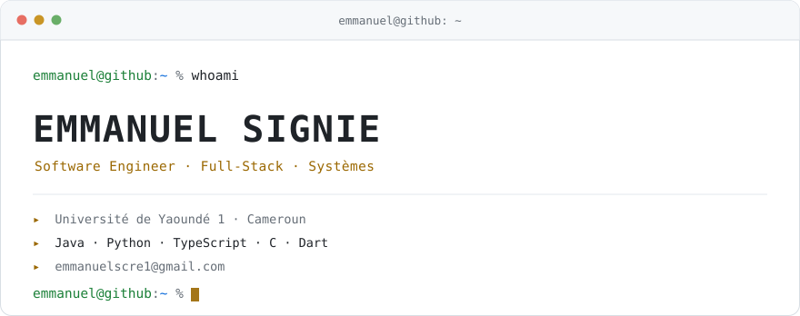
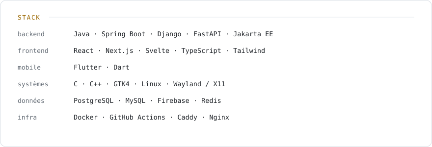

<picture>
  <source media="(prefers-color-scheme: dark)" srcset="assets/hero-dark.svg">
  <source media="(prefers-color-scheme: light)" srcset="assets/hero-light.svg">
  
</picture>

 

Je conçois et construis des systèmes complets — d'une API bancaire testée à 100 % de couverture de branches à un gestionnaire de presse-papiers natif pour Linux. Ce qui m'intéresse : les architectures qui tiennent, le code qu'on peut relire six mois plus tard, et les tests qui prouvent quelque chose.

Actuellement en licence à l'Université de Yaoundé 1, et en mission sur des projets clients en parallèle (e-commerce, conseil, applications métier).

 

<picture>
  <source media="(prefers-color-scheme: dark)" srcset="assets/stack-dark.svg">
  <source media="(prefers-color-scheme: light)" srcset="assets/stack-light.svg">
  
</picture>

 

## Projets

| Projet | Description | Stack |
| :--- | :--- | :--- |
| **[GrandMind](https://github.com/Emmanuel-dev-lab/GrandMind)** | Coach d'échecs qui analyse vos parties, identifie vos faiblesses récurrentes et vous les fait rejouer en répétition espacée. | Python · FastAPI · Svelte |
| **[banking-api-100-coverage](https://github.com/Emmanuel-dev-lab/banking-api-100-coverage)** | API bancaire REST — comptes, prêts, JWT. **100 % de couverture de branches** vérifiée par JaCoCo à chaque build. | Java 21 · Spring Boot · PostgreSQL |
| **[e-istc-elearning](https://github.com/Emmanuel-dev-lab/e-istc-elearning)** | Plateforme e-learning monolithique : cours, évaluations, forums, messagerie. Trois rôles, déploiement Docker. | Django · PostgreSQL · Docker |
| **[NotesSup](https://github.com/Emmanuel-dev-lab/NotesSup)** | Gestion de notes universitaire — classements cloisonnés par niveau et filière, trois rôles. | Jakarta EE 11 · Java 21 · MySQL |
| **[clipto-linux](https://github.com/Emmanuel-dev-lab/clipto-linux)** | Gestionnaire de presse-papiers natif : texte, images, épinglage. Fonctionne sous X11 et Wayland. | Python · GTK4 · LibAdwaita |
| **[portfolio](https://github.com/Emmanuel-dev-lab/portfolio)** | Portfolio statique avec terminal interactif et scène 3D WebGL. Aucun backend. | JavaScript · WebGL |
| **[EcoleChat](https://github.com/Emmanuel-dev-lab/chat)** | Messagerie scolaire sécurisée : rôles, modération, tableau de bord d'administration. | Next.js 15 · TypeScript · Firebase |
| **[plum-api](https://github.com/CodeStorm-mbe/plum-api)** | Classification automatique de prunes africaines par vision par ordinateur — projet d'équipe [CodeStorm](https://github.com/CodeStorm-mbe). | Django · PyTorch · Vision |
| **[doktaLink](https://github.com/Emmanuel-dev-lab/doktaLink)** | Modélisation UML complète d'une plateforme de téléconsultation médicale. Projet de fin d'études. | UML · PlantUML · Architecture |

Une partie de mon travail se fait sur des dépôts privés — missions clients et projets en cours. Accès possible sur demande.

 

## Activité

<picture>
  <source media="(prefers-color-scheme: dark)" srcset="https://streak-stats.demolab.com?user=Emmanuel-dev-lab&hide_border=true&border_radius=10&background=0B0F14&border=222B36&stroke=222B36&ring=E3B341&fire=E3B341&currStreakLabel=E3B341&sideLabels=C9D1D9&currStreakNum=C9D1D9&sideNums=C9D1D9&dates=6E7681">
  
</picture>

<table>
<tr>
<td width="50%">

<picture>
  <source media="(prefers-color-scheme: dark)" srcset="https://github-readme-stats.vercel.app/api?username=Emmanuel-dev-lab&show_icons=true&hide_border=true&bg_color=0B0F14&title_color=E3B341&text_color=C9D1D9&icon_color=7EE787">
  
</picture>

</td>
<td width="50%">

<picture>
  <source media="(prefers-color-scheme: dark)" srcset="https://github-readme-stats.vercel.app/api/top-langs/?username=Emmanuel-dev-lab&layout=compact&hide_border=true&langs_count=8&bg_color=0B0F14&title_color=E3B341&text_color=C9D1D9">
  
</picture>

</td>
</tr>
</table>

 

## Contact

[emmanuelscre1@gmail.com](mailto:emmanuelscre1@gmail.com)
